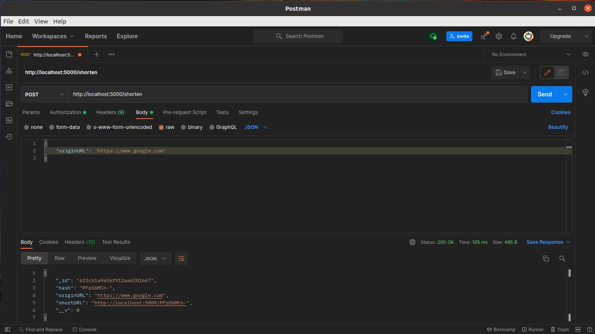

# Shortener URL

#### Esse é o repositório do backend do projeto, o front está [neste](https://github.com/rodrigoaqueiroz/url-shortener-frontend) repositório.

--- 

# Habilidades

  - node express;
  - utilização do MongoDB Atlas
  - type script;
  - ligação do back com o front;

--- 

# Instruções

 - Primeiro é necessário instalar as dependencias, na pasta raiz digite:
  '''npm install'''
 - Depois execute o script para rodar a API
 '''npm run dev'''

  Pronto, a API já está funcionando (rodando na porta 5000). Agora, basta acessar as instruções do front end para startar a aplicação lá com a integração entre front e back.

---

#### API

A API consiste em um serviço simples com três endpoints:
  - `/` que retorna a home do projeto; 
  - `/shorten` que há um imput onde o usuário digiará a URL que deseja ser encurtada;
  - `/about` que retorna informações sobre o autor.

---

#### Resposta

A resposta da requisição possui os seguintes campos:

- **-id**: id que foi salvo no MONGODB Atlas;

- **has**: a hash gerada para encurtar a URL;

- **originURL**: a URL digitada pelo usuário;

- **shortURL**: a URL encurtada.

- **__v**: a versão do documento criado pelo mongoose.

A resposta é em formato `JSON`, e o retorno é sempre um array de objetos. Abaixo, um exemplo:

```JSON
{
    "_id": "622777e3e486ceea18147b2a",
    "hash": "kpLeYpClk",
    "originURL": "HTTP://WWW.UOL.COM.BR",
    "shortURL": "http://localhost:5000/kpLeYpClk",
    "__v": 0
}
```

Imagem de um retorno:



---

# Contatos:

<div style="display: flex; align-items: center; justify-content: space-between;">
  <div>
    <h4> Rodrigo de A. Queiroz </h4>
  <div style="display: flex; align-items: center;">
      https://www.linkedin.com/in/rodrigoandradequeiroz/
  </div>
  <br/>
  <div style="display: flex;align-items: center;">
     https://github.com/rodrigoaqueiroz
  </div>
  <br/>
  <div style="display: flex;align-items: center;">
    </img>
    <a href="mailto:rodrigoandradequeiroz@gmail.com">rodrigoandradequeiroz@gmail.com</a>
  </div>
<br/>

